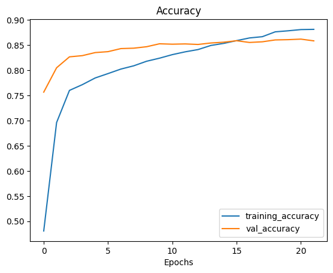
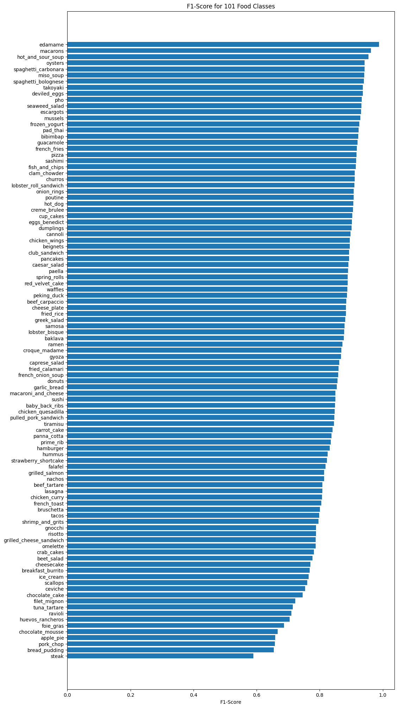
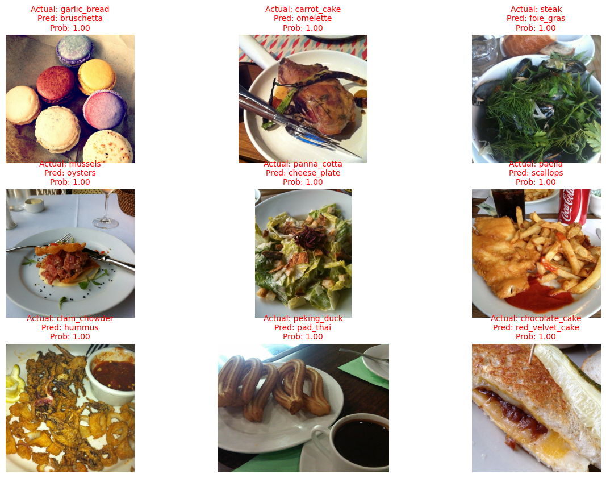
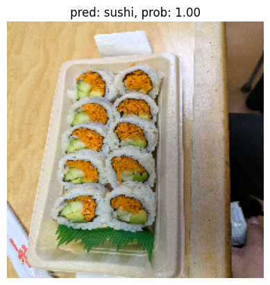

# Food101: Surpassing Research Benchmarks with EfficientNetB0

[](https://www.tensorflow.org/)
[](https://www.python.org/)
[](LICENSE)
[-brightgreen)](https://www.researchgate.net/publication/304163308_DeepFood)

**Author:** Puneet Sharma  

An end-to-end computer vision pipeline developed in TensorFlow/Keras that achieves **84.97% test accuracy** across the entire 101-class Food-101 benchmark (25,250 test samples), outperforming the seminal **DeepFood (2016) 77.4% accuracy benchmark by +7.57%**.

---

## Table of Contents
- [Project Overview](#project-overview)
- [Benchmark Comparison](#benchmark-comparison)
- [System Architecture & Training Strategy](#system-architecture--training-strategy)
- [Data Pipeline & Optimization](#data-pipeline--optimization)
- [Experimentation History](#experimentation-history)
- [Evaluation & Error Analysis](#evaluation--error-analysis)
- [Inference on Custom Images](#inference-on-custom-images)
- [Repository Structure](#repository-structure)
- [Setup & Installation](#setup--installation)
- [Model Weights & Artifact Management](#model-weights--artifact-management)

---

## Project Overview

Food-101 is an image classification dataset consisting of 101,000 real-world food photographs spanning 101 categories (750 training images and 250 test images per category). By design, the training split contains real-world label noise, color variance, and uncurated web photography.

The goal of this project is to surpass established research baselines (DeepFood 2016) using transfer learning with an EfficientNetB0 backbone, optimized `tf.data` input streaming, mixed-precision arithmetic (`float16`), and fine-tuning with regularization.

---

## Benchmark Comparison

| Architecture / Model | Test Accuracy (101 Classes) | Evaluation Set Size | Delta vs. DeepFood |
| :--- | :---: | :---: | :---: |
| **DeepFood (2016 Baseline)** | 77.40% | 25,250 images | Baseline |
| **Model 0 (Feature Extraction)** | ~70.80% | 25,250 images | -6.60% |
| **Model 1 (Fine-Tuned Baseline)** | ~81.20% | 25,250 images | +3.80% |
| **Model 2 (Fine-Tuned + Augmentation)** | ~83.40% | 25,250 images | +6.00% |
| **Model 3 (Final: Dropout 0.3 + Augmentation)** | **84.97%** | **25,250 images** | **+7.57%** |

> *Note on Validation Fluctuations:* During training, validation accuracy peaked at **86.20%** on a 15% monitoring split. Rigorous evaluation across the full 25,250 test images confirmed a stabilized generalization score of **84.97%**.

---

## System Architecture & Training Strategy

```text
Input Image (224x224x3, uint8)
   │
   ▼
[CPU Data Augmentation: Random Flip, Rotation, Zoom, Translation]
   │
   ▼
[EfficientNetB0 Backbone (Unfrozen - ~4M Trainable Parameters)]
   │
   ▼
[GlobalAveragePooling2D]
   │
   ▼
[Dropout (rate = 0.3)]
   │
   ▼
[Dense (101 Units, Activation='linear')]
   │
   ▼
[Activation ('softmax', dtype='float32')] ──> Class Probabilities (101)
```

1. **Feature Extraction:** Pre-trained ImageNet weights loaded into a frozen EfficientNetB0 backbone to establish initial top-layer convergence.
2. **Global Fine-Tuning:** Unfreezing all layers of the EfficientNetB0 backbone with a scaled learning rate ($1 \times 10^{-4}$), allowing low- and mid-level feature representations to adapt to food textures.
3. **Data Regularization:** Adding a `Dropout(0.3)` layer directly before classification to suppress co-adaptation of features.
4. **Learning Rate Scheduling:** Dynamic reduction via `ReduceLROnPlateau` (factor=0.2, patience=2) and `EarlyStopping` (patience=3) to halt overfitting.

---

## Data Pipeline & Optimization

To maximize GPU utilization (NVIDIA A100 / T4) and prevent IO-bound pipeline bottlenecks:
* **Batch Prefetching & Parallelism:** Pipelined with `num_parallel_calls=tf.data.AUTOTUNE` and `prefetch()`.
* **CPU-Bound Vectorized Augmentation:** Transformations applied asynchronously during GPU computation cycles.
* **Mixed Precision Policy:** Enabled `mixed_float16` compute to leverage Tensor Cores, while keeping the final Softmax head on `float32` for numerical stability.

---

## Experimentation History

The project followed an iterative ML experimental lifecycle tracked via TensorBoard:

* **Model 0 (Feature Extractor):** Frozen base model; 5 epochs; fast convergence as baseline validator.
* **Model 1 (Fine-Tuned - No Augmentation):** Full network backpropagation; observed steady gains followed by validation divergence (overfitting).
* **Model 2 (Fine-Tuned + Data Augmentation):** Integrated random zoom, horizontal flip, and rotation; closed the generalization gap.
* **Model 3 (Fine-Tuned + Dropout + Augmentation):** Added `Dropout(0.3)` and adaptive learning rate decay; achieved peak convergence at Epoch 21.

---

## Evaluation & Error Analysis

### 1. Training & Loss Curves
Training and validation convergence curves illustrating loss reduction and validation accuracy trajectory across training epochs:



### 2. Per-Class F1-Score Breakdown
Evaluation across all 101 food classes ranked by individual F1-score:



* **Top Performing Classes (F1 > 0.94):** `edamame`, `hot_and_sour_soup`, `oysters`, `pad_thai`.
* **Challenging Classes (F1 < 0.70):** `steak` vs. `pork_chop`, `filet_mignon` vs. `prime_rib` (fine-grained categories with shared culinary textures and garnishes).

### 3. Most Confident Misclassifications
A 3x3 error inspection grid depicting test instances where the model yielded high confidence in an incorrect prediction:



---

## Inference on Custom Images

The model was tested against unseen, user-provided smartphone images outside the Food-101 distribution:



To run inference on your own images:
```python
import tensorflow as tf
from helper_functions import load_and_prep_image

# Load peak model
model = tf.keras.models.load_model("model3.keras")

# Preprocess & Predict
img = load_and_prep_image("custom_food_images/my_food.jpg", scale=False)
pred_prob = model.predict(tf.expand_dims(img, axis=0))
predicted_class = class_names[pred_prob.argmax()]
print(f"Prediction: {predicted_class} ({pred_prob.max():.2%})")
```

---

## Repository Structure

```text
├── custom_food_images/        # Unseen sample test photographs
├── docs/
│   └── images/                # Exported figures, loss curves, and confusion charts
│       ├── model3_loss_accuracy_curves.png
│       ├── f1_scores_per_class.png
│       ├── top_confident_mistakes.jpg
│       └── custom_food_predictions.png
├── helper_functions.py        # Reusable plotting, preprocessing, and callback utilities
├── Food101.ipynb              # Complete end-to-end training and evaluation notebook
├── requirements.txt           # Environment dependencies
├── .gitignore                 # Excludes heavy checkpoints, logs, and datasets
└── README.md
```

---

## Setup & Installation

### 1. Clone the Repository
```bash
git clone [https://github.com/puneet25j/Food101.git](https://github.com/puneet25j/Food101.git)
cd Food101
```

### 2. Configure Environment
Create and activate an isolated Python environment:
```bash
python3 -m venv venv
source venv/bin/activate  # On Windows: venv\Scripts\activate
pip install -r requirements.txt
```

### 3. Run Experiments
Open the notebook in your preferred environment (Jupyter Lab or Google Colab):
```bash
jupyter lab Food101.ipynb
```

---

## Model Weights & Artifact Management

Trained model weights and binary graph files are excluded from git tracking to adhere to GitHub file size limitations:

* **Saved Model File:** `model3.keras` (~80 MB)
* **Checkpoint Weights:** `model_checkpoints/model3.weights.h5` (~80 MB)
* **TensorBoard Event Logs:** `training_logs/`

To reproduce inference or fine-tuning without retraining:
1. Download the pre-trained weights from [Releases](https://github.com/puneet25j/Food101/releases).
2. Place `model3.keras` directly in the project root.